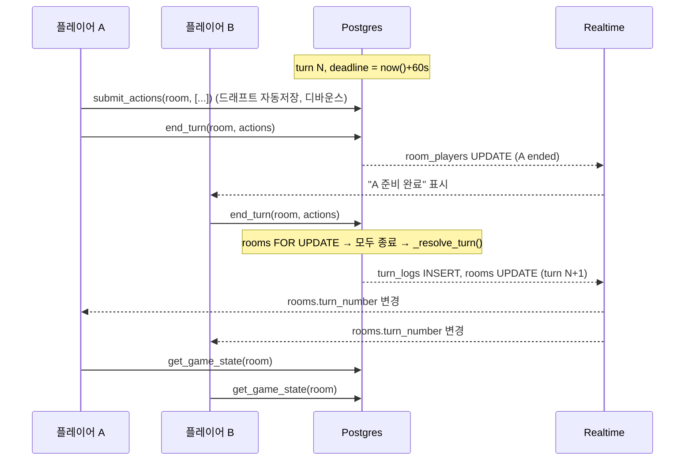

# 역사 문명전: 실시간 동기화 아키텍처

## 1. 핵심 원칙

| 원칙 | 내용 |
|---|---|
| **DB가 판정한다** | 클라이언트는 명령(action)만 보내고 결과는 계산하지 않는다. 이동, 전투, 생산, 승리 판정은 모두 `_resolve_turn()`(PL/pgSQL)에서 처리한다. |
| **쓰기는 RPC로만** | 모든 테이블에 RLS를 켜고 INSERT/UPDATE/DELETE 정책은 두지 않는다. 쓰기 경로는 `SECURITY DEFINER` RPC뿐이라 치트(골드 조작, 유닛 순간이동)가 막힌다. |
| **명령은 비공개** | `turn_actions`는 본인 행만 SELECT할 수 있다. 동시 턴에서 상대의 이동을 미리 볼 수 없다. |
| **Realtime은 신호, 데이터는 스냅샷** | 턴마다 수백 개의 타일/유닛 변경을 postgres_changes로 받지 않는다. `rooms.turn_number` 변경을 신호로 받고, `get_game_state()`로 전체 상태를 한 번에 다시 가져온다. 이벤트 유실이나 순서 꼬임이 생기지 않는다. |
| **정산은 정확히 1회** | `rooms` 행을 `FOR UPDATE`로 잠그고, 기대 턴 번호(`p_turn`)를 비교해서 멱등하게 처리한다. |

## 2. 구성도

```
┌──────────── React Client ────────────┐          ┌──────────────── Supabase ────────────────┐
│ Zustand store                         │          │ Postgres                                  │
│  ├ pendingActions (로컬 명령 큐)       │  RPC     │  rooms / room_players / game_tiles        │
│  ├ snapshot (get_game_state 결과)     │ ───────▶ │  units / turn_actions / turn_logs         │
│  └ selection / UI                     │          │  leaderboard / match_results              │
│                                       │          │  _resolve_turn()  ← 유일한 게임 로직       │
│ useLobby     ── Presence(온라인)      │ ◀─────── │ Realtime                                   │
│ useGameSync  ── postgres_changes      │  WS      │  • postgres_changes: rooms, room_players, │
│ useTurnTimer ── deadline − clockSkew  │          │    turn_logs (RLS 적용)                    │
│              ── Broadcast(핑/이모트)  │          │  • presence / broadcast: room:{id}        │
└───────────────────────────────────────┘          │ pg_cron: _sweep_expired_turns() (백업)     │
                                                   └───────────────────────────────────────────┘
```

## 3. Realtime 채널 설계

채널은 방마다 하나(`room:{roomId}`)이고, 세 기능을 함께 쓴다.

| 기능 | 용도 | 권위(authority) |
|---|---|---|
| **Presence** | 접속 중인지, 누가 보고 있는지 (key = user_id) | 표시용. 준비 상태는 DB `is_ready`가 기준 |
| **Postgres Changes** | `rooms` UPDATE(상태/턴/마감), `room_players` 변경(준비/턴종료 체크), `turn_logs` INSERT(애니메이션) | DB |
| **Broadcast** | 채팅, 이모트, 맵 핑처럼 게임 결과와 무관한 휘발성 메시지 | 없음 |

## 4. 턴 라이프사이클



**타이머 만료 경로**
1. 각 클라이언트는 `deadline - (clientNow - serverNow 보정값)`으로 남은 시간을 계산한다.
2. 0초가 되면 `try_resolve_turn(room, N)`을 호출한다. 여러 명이 동시에 호출해도 잠금과 턴 번호 비교 때문에 **한 번만** 정산되고, 나머지는 `false`를 받는다.
3. 모두 접속이 끊기면 pg_cron `_sweep_expired_turns()`가 마감 3초 후에 정산한다.

**동시 이동 충돌 규칙** (`_resolve_turn` 3단계)
- 모든 `move` 명령을 `initiative DESC → hp DESC → random()` 순서로 하나씩 처리한다.
- 먼저 도착한 유닛이 칸을 차지한다. 나중에 온 아군 유닛은 이동이 취소되고, 적군 유닛은 **공격**이 된다.
- 근접 공격으로 방어자를 격파하면 그 칸으로 진입하고, 도시라면 점령한다. 수도를 점령하면 상대 문명이 멸망한다.
- 원거리 유닛(range 2: 포병, 기관총병, 철갑함)은 반격을 받지 않고, 공격 후 제자리에 남는다.
- 기병(6)과 나폴레옹(8)은 선제권이 높아 "먼저 움직이는" 이점을 받는다.

## 5. 액션 스키마 (`turn_actions.actions` jsonb 배열)

```ts
type Action =
  | { type: 'move';       unit_id: string; x: number; y: number }
  | { type: 'found_city'; unit_id: string; name?: string }
  | { type: 'produce';    x: number; y: number; unit_kind: UnitKind }
  | { type: 'build';      x: number; y: number; improvement: 'farm'|'railway'|'factory'|'port' }
  | { type: 'research';   tech: TechId }
  | { type: 'spread' };   // 골드 10 → 이념 +3
```
`_valid_action()`이 형식을 검증하고, 규칙 위반(이동력 초과, 산악 진입 등)은 정산 중에 **조용히 무시**한다. 클라이언트도 같은 규칙으로 미리보기를 보여 주되, 최종 판정은 서버가 한다.

## 6. 승리 조건 (정산 8단계)

| 승리 | 판정 |
|---|---|
| 정복 | 멸망하지 않은 플레이어가 1명 이하 (수도를 잃으면 멸망) |
| 과학 | `new_weapons`(증기기관 → 전기화 → 신무기) 연구 완료 |
| 문화 | 이념 점수 100 이상 중 1위 (인권선언 연구 즉시 +15) |
| 점수 | `max_turns`(60) 도달 시 최고 승점 |

게임이 끝나면 `_finish_game()`이 승자에게 +50점을 주고, `match_results`에 기록하고, `leaderboard`에 누적한다. 순위는 `leaderboard_ranked` 뷰(`rank()`)로 조회한다.

## 7. 클라이언트 동기화 골격 (2단계에서 구현)

```ts
// useGameSync.ts (요지)
const channel = supabase.channel(`room:${roomId}`)
  .on('postgres_changes', { event: 'UPDATE', schema: 'public', table: 'rooms', filter: `id=eq.${roomId}` },
      ({ new: r }) => { if (r.turn_number !== store.turn || r.status !== store.status) refetch(); })
  .on('postgres_changes', { event: '*', schema: 'public', table: 'room_players', filter: `room_id=eq.${roomId}` },
      ({ new: p }) => store.patchPlayer(p))                       // 턴 종료 체크 표시
  .on('postgres_changes', { event: 'INSERT', schema: 'public', table: 'turn_logs', filter: `room_id=eq.${roomId}` },
      ({ new: log }) => store.queueAnimations(log.events))
  .subscribe((s) => { if (s === 'SUBSCRIBED') refetch(); });     // 재연결 시에도 스냅샷으로 복구

async function refetch() {
  const { data } = await supabase.rpc('get_game_state', { p_room: roomId });
  store.setSnapshot(data, Date.parse(data.server_now) - Date.now()); // clockSkew 저장
}
```

## 8. 설정 체크리스트

1. Dashboard → Authentication → **Anonymous sign-ins 활성화**
2. `supabase db push` (또는 SQL Editor에 마이그레이션 붙여넣기)
3. (선택) Database → Extensions → `pg_cron` 활성화 후 파일 맨 아래의 `cron.schedule` 실행
4. 클라이언트: `signInAnonymously()` 후 `rpc('ensure_profile', { p_nickname })`

## 9. 알려진 단순화 (다음 단계 후보)
- 이동은 체비셰프 거리만 확인하고 경로 탐색은 하지 않는다. 중간의 산이나 적 유닛을 통과할 수 있다.
- 시야(Fog of War)가 없다. 적용하려면 `units` RLS 대신 `get_game_state`에서 시야로 필터링해야 한다.
- 한 칸에는 유닛 하나만 있을 수 있다(스택 금지).
